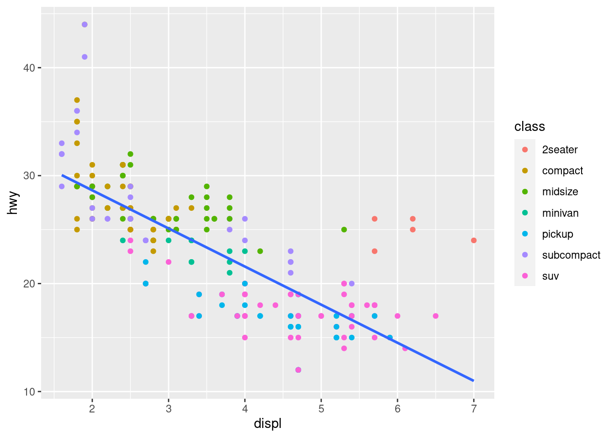

<!-- index.md is generated from index.Rmd. Please edit that file -->

# ggcheck

<!-- badges: start -->

[](https://CRAN.R-project.org/package=ggcheck)
[](https://github.com/rstudio/ggcheck/actions)
<!-- [](https://cran.r-project.org/package=ggcheck) -->
<!-- badges: end -->

ggcheck provides functions that inspect
[ggplot2](https://ggplot2.tidyverse.org) objects to make it easier for
teachers to check that student plots meet expectations. Designed
primarily for automated grading via
[gradethis](https://pkgs.rstudio.com/gradethis) in interactive
[learnr](https://rstudio.github.io/learnr/) tutorials.

## Installation

You can install ggcheck from
[GitHub](https://github.com/rstudio/ggcheck) with:

``` r
# install.packages("remotes")
remotes::install_github("rstudio/ggcheck")
```

## Usage

The primary goal of ggcheck is to help tutorial authors inspect and test
properties of [ggplot2](https://ggplot2.tidyverse.org) plots. The
examples below demonstrate how ggcheck can be used in general; for more
information about using gradethis in learnr tutorials, please see the
[gradethis package documentation](https://pkgs.rstudio.com/gradethis/).

Suppose an exercise asks students to create the following plot of engine
displacement vs highway miles per gallon ratings.

``` r
library(ggplot2)

p <-
  ggplot(data = mpg, mapping = aes(x = displ, y = hwy)) +
  geom_point(mapping = aes(color = class)) +
  geom_smooth(se = FALSE, method = "lm")

p
#> `geom_smooth()` using formula 'y ~ x'
```



We can use ggcheck to test that students used `geom_point()`

``` r
library(ggcheck)

uses_geoms(p, "point", exact = FALSE)
#> [1] TRUE
```

or that both `geom_point()` and `geom_smooth()` were used

``` r
uses_geoms(p, c("point", "smooth"), exact = FALSE)
#> [1] TRUE
```

or that exactly both `geom_point()` and `geom_smooth()` were used and in
that order.

``` r
uses_geoms(p, c("point", "smooth"), exact = TRUE)
#> [1] TRUE
```

Similarly, we can test that a linear model was used for the smoothing
method and the confidence interval was not displayed:

``` r
uses_geom_param(p, "smooth", list(se = FALSE, method = "lm"))
#> [1] TRUE
```

There’s a lot more that ggcheck can do. Read more in the [full function
listing](https://rstudio.github.io/ggcheck/).

## Code of Conduct

Please note that the tblcheck project is released with a [Contributor
Code of
Conduct](https://contributor-covenant.org/version/2/0/CODE_OF_CONDUCT.html).
By contributing to this project, you agree to abide by its terms.
